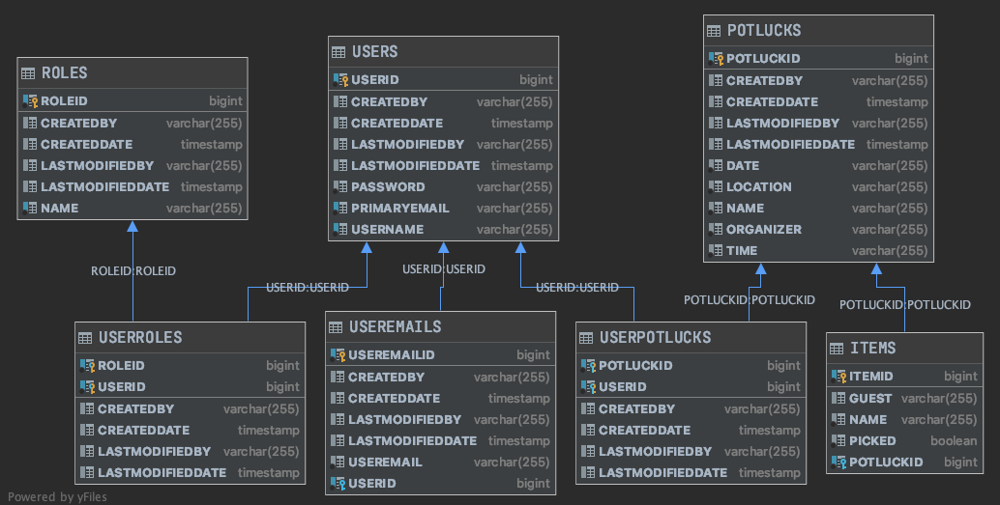

# Potluck Planner

## Table of Contents

- **[Overview](#overview)** 
- **[Database Schema](#db-schema)** 
- **[Project Setup](#project-setup)** 
- **[Swagger Documentation](#swagger-documentation)** 
- **[API Endpoints](#api-endpoints)** 

## Overview

Potluck Planner is your online solution to the difficulties in planning and organizing a potluck event. No more endless text messages, online todo lists, and spreadsheets. In the world of social gatherings and potlucks, "Potluck Planner" is king. This is your place for all things potluck. 

### At Potluck Planner
1. As an organizer I can create an upcoming potluck event
2. As an organizer I can invite/add friends to the event
3. As an organizer I can set/update the event's name, location, date, and time
4. As an organizer I can list suggested food items to bring
5. As a guest I can add/remove myself from a potluck event
6. As a guest I can indicate which food item I plan to bring
7. As a user I can act as an organizer and as a guest

Potluck Planner is a full stack web application composed of a front end React SPA providing the user interface and a Java Spring Web REST API using a PostgreSQL database hosted on Heroku.

[Potluck Planner Front End GitHub Repo](https://github.com/PotLuck-BuildWeek-web38/frontend)

[Potluck Planner Back End BaseURL](https://potluck-tt11.herokuapp.com)

## Database Schema

## Project Setup

#### The application was created as a modification of the Lambda School Backend Foundation application which was created in IntelliJ using the Spring Boot Initializer.

#### Note: The Java Spring Backend application utilizes OAUTH2 Authorization and Authentication requiring environment variables needed by both the local and the deployed application.

OAUTHCLIENTID, OAUTHCLIENTSECRET

### For PostgreSQL a Maven Dependency has been added to the POM file. 

A DataSourceConfig.java class allows the application to convert back and forth between a h2 in-memory db or a local postgresql db for development.

Heroku deployment includes the addon hobby-dev free version of postgreSQL.

### Deployment to Heroku using Maven

#### Setup Heroku from the CLI

heroku login

heroku create yourappname

heroku addons:create heroku-postgresql:hobby-dev -a yourappname

heroku config -a yourappname

heroku config:set OAUTHCLIENTID=lambda-client -a yourappname

heroku config:set OAUTHCLIENTSECRET=lambda-secret -a yourappname

Use the heroku GUI to access log

#### Inside the Java Application in IntelliJ

Add the plugin for heroku

    <finalName>yourappname</finalName>

    <!-- Heroku Maven Plugin Configuration -->
    <plugin>
        <groupId>com.heroku.sdk</groupId>
        <artifactId>heroku-maven-plugin</artifactId>
        <version>3.0.2</version>
        <configuration>
            <appName>${project.build.finalName}</appName>
            <includeTarget>false</includeTarget>
            <includes>
                <include>${project.build.directory}/${project.build.finalName}.jar</include>
            </includes>
            <jdkVersion>${java.version}</jdkVersion>
            <processTypes>
                <web>java $JAVA_OPTS -Dserver.port=$PORT -jar target/${project.build.finalName}.jar</web>
            </processTypes>
        </configuration>
    </plugin>

A SimpleCorsFilter.java class has been added to handle deploying and CORS issues with current settings allowing all origins.

Deploying from IntelliJ

To actually deploy, go to the 
Maven Tab

Turn on Skip Test Mode

Maven Goals

mvn clean heroku:deploy -X

You need to do this each time code is changed!

#### Additional notes on project setup and deployment are located inside the resource folder of the main application in the file DeploymentNotes.txt

## SwaggerDocumentation

[Swagger Documentation](https://potluck-tt11.herokuapp.com/swagger-ui.html)

Custom swagger API documentation was generated using swagger annotations on java models and controller routes.

## API endpoints

### https://potluck-tt11.herokuapp.com

### **_Authentication (for registration and login)_**

| Method        | Endpoint           | Body (required)                       | Body (optional) | Notes                                             |
| ------------- | ------------------ | ------------------------------------- | --------------- | ------------------------------------------------- |
| register POST | /api/createnewuser | username, password, primaryemail | N/A             | Creates a new user object in the database, logs in user, returns an access_token for authentication        |
| login POST    | /api/login    | username, password                    | N/A             | Returns an access_token for authentication |

### **_OAUTH Authentication Sample POST Requests_**

Create a new user and login:

    axios
        .post('https://potluck-tt11.herokuapp.com/createnewuser', newUser)
        .then((res) => {
            localStorage.setItem('access_token', res.data.access_token);
        })

Login an existing user:

    axios
        .post(
            'https://potluck-tt11.herokuapp.com/login',
            `grant_type=password&username=${loginFormValues.name}&password=${loginFormValues.password}`,
            {
                headers: {
                    Authorization: `Basic ${btoa('lambda-client:lambda-secret')}`,
                    'Content-Type': 'application/x-www-form-urlencoded',
                },
            }
        )
        .then((res) => {
				localStorage.setItem('token', res.data.access_token);
			})

### All other routes require an authenticated user. The access_token must be included in the request header

Sample axiosWithAuth:

    export const axiosWithAuth = () => {
        const token = localStorage.getItem("token");
        
        return axios.create({
            headers: {
                Authorization: `Bearer ${token}`,
            },
            baseURL: "https://potluck-tt11.herokuapp.com",
        });
    };

### **_Endpoints for the Users_**

| Method                        | Endpoint                           | Body (required) | Body (optional) | Notes                                                            |
| ------------- | ------------------ | ------------------------------------- | --------------- | ------------------------------------------------- |
| get user GET    | /api/users/getuserinfo  | N/A             | N/A             | Fetches authenticated user      |
| get all users GET  | /api/users/users | N/A             | N/A             | Fetches all users                  |
| get user by userid GET   | /api/users/user/:userid  | N/A       | N/A             | Fetches user by userid  |
| get user by username GET  | /api/users/user/name/:username  | N/A       | N/A             | Fetches user by username |
| get user by like username GET | /api/users/user/name/like/:subname | N/A        | N/A             | Fetches users with subname in username |
| add a new user POST  | /api/users/user    | username, primaryemail, password | potlucks  | Adds a new user  |
| update a full user PUT | /api/users/user/:userid | username, primaryemail, password   | N/A             | Updates entire user |
| update a user with partial info PATCH   | /api/users/user/:userid   | username, primaryemail, password | potluck      | Updates the user  |
| delete user by userid DELETE | /api/users/user/:userid | N/A     | N/A    | Deletes the user               |

### **_Endpoints for the Potlucks_**

| Method                        | Endpoint                           | Body (required) | Body (optional) | Notes                                                            |
| ------------- | ------------------ | ------------------------------------- | --------------- | ------------------------------------------------- |
| get all potlucks GET | /api/potlucks/potlucks  | N/A           | N/A             | Fetches all potlucks   |
| get all potlucks organized by user GET | /api/potlucks/getpotluckinfo  | N/A             | N/A             | Fetches potlucks organized by user |
| get potluck by potluckid GET | /api/potlucks/potluck/:potluckid  | N/A       | N/A             | Fetches potluck   |
| add a new potluck POST | /api/potlucks/potluck       | name, organizer, location, date, time | items, users | Adds potluck  |
| update a full potluck PUT | /api/potlucks/potluck/:potluckid | name, organizer, location, date, time | items, users| Updates the potluck |
| delete potluck by potluckid DELETE | /api/potlucks/potluck/:potluckid | N/A           | N/A             | Deletes the potluck  |

### **_Endpoints for Items_**

| Method                        | Endpoint                           | Body (required) | Body (optional) | Notes                                                            |
| ------------- | ------------------ | ------------------------------------- | --------------- | ------------------------------------------------- |
| get all items GET | /api/potlucks/item   | N/A             | N/A             | Fetches all items  |
| get item by itemid  GET | /api/potlucks/item/:itemid | N/A           | N/A             | Fetches an item |
| update item by itemid PATCH | /api/potlucks/updateitem/:itemid  | N/A       | guest, name, picked, potluck | Updates item |
| deletes an item by itemid DELETE | /api/potlucks/item/:itemid      | N/A           | N/A        | Deletes item    |

### **_Endpoints for Guests_**

| Method                        | Endpoint                           | Body (required) | Body (optional) | Notes                                                            |
| ------------- | ------------------ | ------------------------------------- | --------------- | ------------------------------------------------- |
| get all user guests GET | /api/potlucks/potluck/:potluckid/guests | N/A       | N/A     | Fetches all users/guests |
| add user as guest  POST | /api/potlucks/potluck/:potluckid/addguest/:userid | N/A       | N/A        | Adds user to potluck |
| remove user as guest DELETE | /api/potlucks/potluck/:potluckid/removeguest/:userid  | N/A       | N/A    | Deletes the user from potluck |
